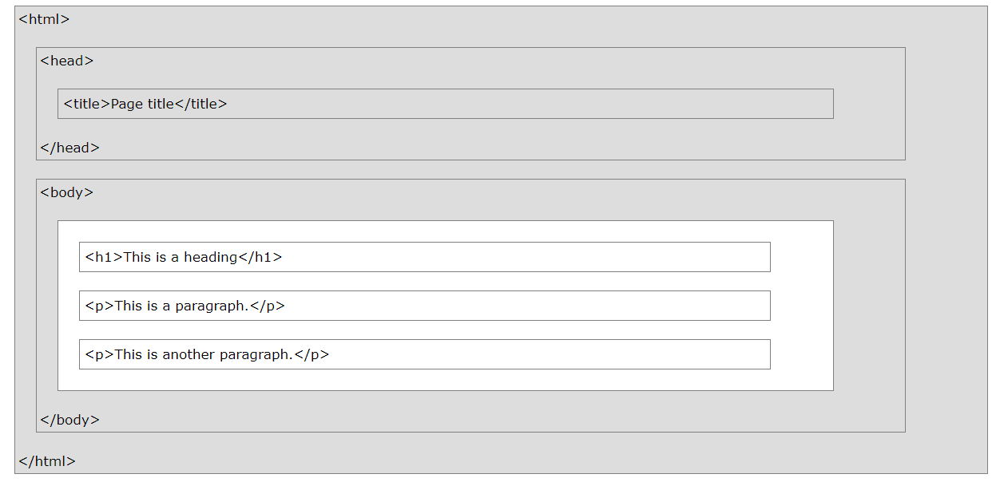
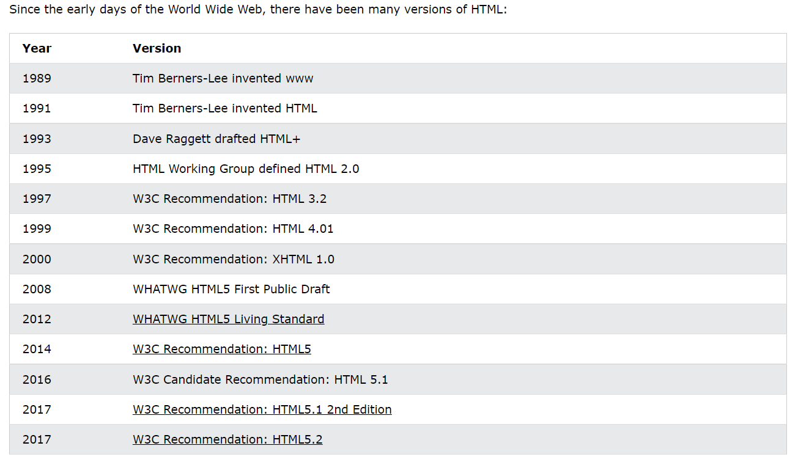

# 01-HTML介紹

> HTML是用於創建網頁的標準語言。

### 什麼是HTML?

* Hyper Text Markup Language。

* HTML代表超文本標記語言。
* HTML用於創建網頁的標準標記語言。
* HTML描述了網頁的結構。
* HTML由一系列的元素組成。
* HTML元素告訴瀏覽器如何顯示內容。
* HTML元素標記內容片段，例如：＂這是一個標題＂。

### 一個簡單的HTML文檔

> Example


> Example說明

```html
<!--

<!DOCTYPE html>聲明定義這是一個HTML5的文檔。
<html>元素是一個html頁面的根元素。
<head>元素包含html頁面的元信息。
<title>元素指定html頁面的標題。
<body>元素定義了文檔的身體。
<p>元素定義了一個段落。

-->

```

### 什麼是HTML元素?

>  一個HTML元素由一個開始標籤、一些內容還有一個結束標籤定義：

```html
<!--
<Start tag>...內容</End tag>
-->
```

> HTML元素是從開始標籤到結束標籤的所有內容：

```html
<h1>
	我的第一個標題
</h1>

<p>
    我的第一個段落
</p>
```

### 網頁瀏覽器

* Web瀏覽器(IE、谷歌、火狐)的目的是讀取HTML文檔，並正確顯示他們。

* 瀏覽器不顯示HTML標籤，而是使用他們來確定如何顯示文檔。

### HTML頁面結構



> 上圖是一個HTML頁面結構的可視化(visualization)。

### HTML歷史



> HTML5是當前的標準。

