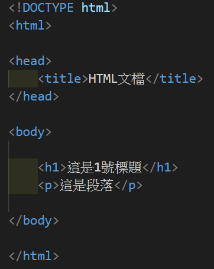

# 01-HTML介紹

> HTML是用於創建網頁的標準語言。

### 什麼是HTML?

* Hyper Text Markup Language。

* HTML代表超文本標記語言。
* HTML用於創建網頁的標準標記語言。
* HTML描述了網頁的結構。
* HTML由一系列的元素組成。
* HTML元素告訴瀏覽器如何顯示內容。
* HTML元素標記內容片段，例如：＂這是一個標題＂。

### 一個簡單的HTML文檔

> 例子

