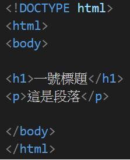

# 02-HTML基礎

### HTML文檔

* 所有的HTML文檔都必須以文檔類型聲明開頭。

* `!DOCTYPE html`

* HTML文檔本身是`html`和`/html`之間。

* HTML文檔的可見部分在`body`和`/body`之間。

> Example



### HTML文檔聲明

* `!DOCTYPE`聲明文檔類型，正確幫助瀏覽器顯示網頁。
* 它只能出現一次，在頁面最頂部。
* !DOCTYPE聲明不區分大小寫。

```html
<!DOCTYPE html>
```

> 上面是HTML5的聲明寫法。

### HTML標題

* HTML標題是用`h1`到`h6`標籤定義的。

* `h1`最重要，後面23456依序遞減重要性。

```html
<h1>
    一號標題
</h1>

<h2>
    二號標題
</h2>

<h3>
    三號標題
</h3>
```

###   HTML段落

> HTML段落是用`p`標籤定義的。

```html
<p>
    八面玲瓏
</p>

<p>
    十面埋伏
</p>
```

### HTML Links

> HTML連結是用`a`標籤定義的。

```html
<a href = "google.com">這是谷歌首頁</a>
```

* 連結的目的在`href`屬性中指定。

* 屬性用於提供有關HTML元素的附加信息。

### HTML Images

* HTML圖像是用`img`標籤定義的。

```html

```

* 源文件`src`
* 替代文本`alt`
* `width`和`height`作為屬性。

